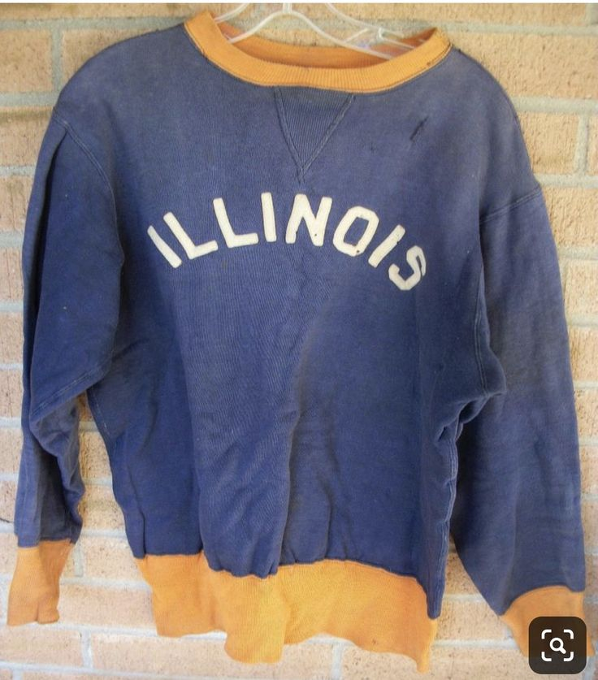
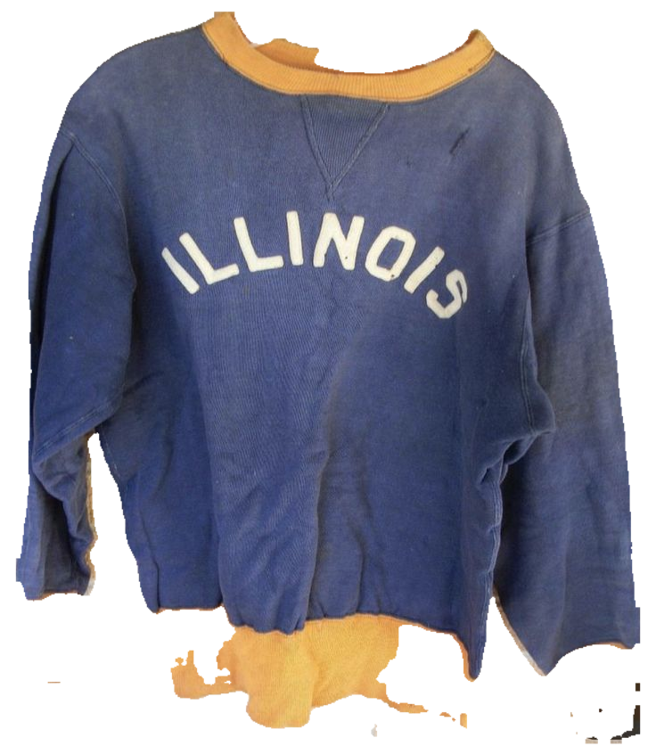
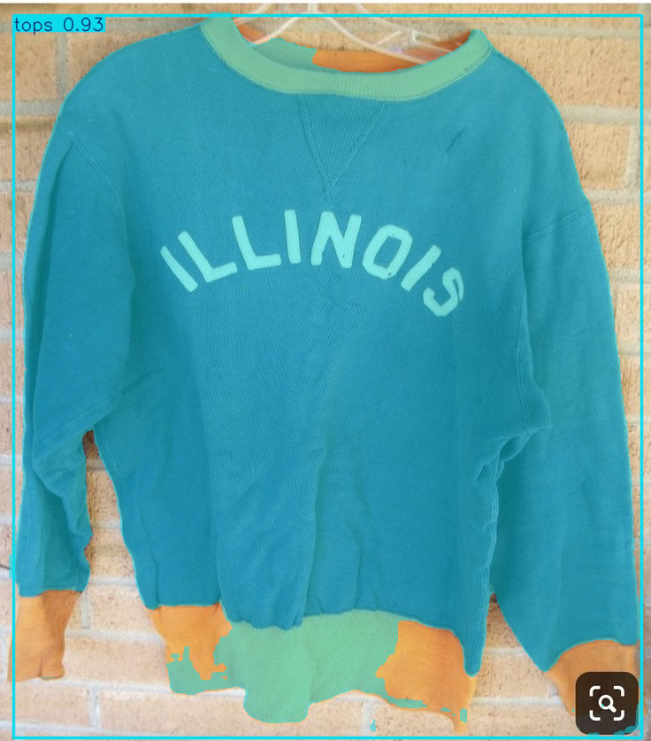

# SmartCloset AI

**服の写真を撮るだけ。AIが切り抜き・属性抽出してクローゼット化し、天気と気分に合わせてコーディネートを提案するWebアプリ。**

- 開発ステータス: **稼働中**(Oracle Cloud上で本番稼働、Phase 0〜6実装完了。[ロードマップ](#ロードマップ))
- 技術スタック: YOLOv8-seg(ファインチューニング) / OpenAI GPT-5.4-nano / FastAPI / Next.js / SQLite / Docker + Caddy + Terraform(Oracle Cloud ¥0運用)

## できること

1. **衣服の自動登録** — 服の写真をアップロードすると、ファインチューニング済みYOLOv8-segが背景を切り抜き、GPT-5.4-nanoがカテゴリ・色(2種)・柄・素材・シルエットを抽出して自動登録
2. **クローゼット閲覧** — 登録した服を背景透過画像で一覧・検索(カテゴリ/色/柄/素材フィルタ)
3. **コーディネート提案** — 「今日は大事な会議。きちんと見せたい」と入力すると、現在地の天気・気温とクローゼットの中身を踏まえてLLMが提案

<!-- TODO(デモ): 完成後のアプリ画面のスクリーンショットを掲載する(UI改善パス実施後に追加予定) -->

### AIパイプラインの処理過程(上記1の中身)

| Original | Mask | Transparent | Annotated |
|---|---|---|---|
|  |  |  |  |

## 背景

衣服管理アプリは「登録が面倒」で使われなくなる。1着ずつブランド・色・カテゴリを手入力し、背景まで綺麗に撮らなければならないからだ。本プロジェクトは**登録コストをAIで限りなくゼロに近づける**ことで、クローゼットのデジタル化と、毎朝の「何を着るか」という決断疲れの解消を狙う。

## 技術ハイライト

### 1. ドメインシフトを特定し、評価体系を作り直した

学習データ(Fashionpedia)の検証精度は良いのに実画像では機能しない——原因は、Fashionpediaが「人物着用の全身写真」で時計や帽子が極小に写るのに対し、本アプリの入力は「単品アップ写真」というスケールの根本的なずれ(ドメインシフト)だった。そこで実ユースケースに沿った**独自テストセット251枚**を構築し、プロダクト指標での評価に切り替えた。→ [PoC開発の記録](docs/poc_history.md)

### 2. クラス設計は3回作り直した(7→13→9クラス)

「accessory」1クラスが13種の形状の寄せ集めで学習が頭打ちになる問題を診断して分割。最終的に「良質な学習データが確保できない×プロダクト重要度が低い」4クラスを**捨てる判断**をして9クラスに確定した。→ [PoC開発の記録](docs/poc_history.md)

### 3. 弱点クラスはデータで解決した

Fashionpediaだけでは検出できなかった shoes / watch / glasses 等を、Roboflow Universe の補強データで統合(**train 52,784枚**)。破滅的忘却を避けるため追加学習ではなくゼロから再学習し、データ拡張+30epochで弱点クラスの認識に成功した。→ [PoC開発の記録](docs/poc_history.md)

### 4. モデル指標×プロダクト指標の二層評価

学習時の標準指標(**Mask mAP50 0.704**)と、実画像251枚の人手評価(**最終登録許容率84.9%**)の両方で評価。両者の乖離分析から「watchはvalで全クラス最高なのに実画像で最悪 → **アノテーション定義とプロダクト要件のずれ**」という診断まで行った。→ [評価と考察](docs/evaluation.md)

### 5. AI駆動開発を設計で統制する

アプリ実装はコーディングエージェント(Claude Code)に委譲する前提で、**設計書だけを見て実装できる粒度の設計書**([design.md](docs/design.md)・約1,800行)と**タスク単位の作業指示書**([todo.md](docs/todo.md))を整備。設計変更はコードより先に設計書を更新する design-first 運用で進める。

## アーキテクチャ

```
[ブラウザ/スマホ]
      │ HTTPS + Basic認証
      ▼
Caddy(:443) ── 外部公開はここのみ・自動HTTPS
 ├─ /api    → FastAPI ── BackgroundTasks: YOLOv8-seg(9クラス) → 背景透過PNG
 │              │                        → GPT-5.4-nano属性抽出 → SQLite保存
 │              └─ OpenWeatherMap / OpenAI API
 ├─ /images → FastAPI ── 背景透過PNG・原画像の配信
 └─ /       → Next.js(クローゼットUI・コーデ提案UI)

デプロイ: Oracle Cloud Always Free ARM VM(Terraformでネットワーク・インスタンスをコード管理。deploy/terraform/)+ Docker Compose(月額¥0 + OpenAI API従量のみ)
```

詳細は [docs/design.md](docs/design.md)(システム構成・API・DB・エラー設計・デプロイ)を参照。

## PoC結果(実画像251枚・人手評価)

| 指標 | 成功率 | 許容率 |
|---|---:|---:|
| YOLOセグメンテーション | 80.1% | 91.6% |
| カテゴリ抽出 | 97.2% | 97.6% |
| 主色抽出 | 99.6% | 99.8% |
| 柄抽出 | 96.0% | 98.8% |
| 素材抽出 | 88.0% | 96.0% |
| **最終登録判定** | **64.5%** | **84.9%** |

- 評価基準: [docs/evaluation.md](docs/evaluation.md)
- モデルレベルの mAP: [docs/val_result_9class_30epoch_data_augmentation.md](docs/val_result_9class_30epoch_data_augmentation.md)
- 登録率のボトルネックはYOLO切り出し精度(watch等)。アプリではメタデータの手動補正機能で運用カバーし、補正データを再学習に還元する設計([design.md 18.2節](docs/design.md))

## ディレクトリ構成

```
backend/          FastAPIアプリ本体(API・DB・AIパイプライン)
frontend/         Next.jsアプリ本体(クローゼットUI・コーデ提案UI)
deploy/           docker-compose.yml・Caddyfile・deploy/terraform/(Oracle Cloud IaC)
docs/             design.md・todo.md・評価資料・docs/images/(デモ画像)
scripts/          backup.sh・restore.sh(VM上のバックアップ・復元)
ai_prototype/     Webアプリを介さないAIパイプラインPoC(Notebook)
training/         YOLOv8-segの学習用Notebook
models/           学習済みモデル重み(Git管理外・別途用意が必要)
```

## Webアプリの動かし方(開発環境)

### 必要なもの

- Python 3.12
- Node.js 20系
- 学習済みモデル重み `models/fashionpedia_9class_with_data_augmentation.pt`(リポジトリ直下の`models/`に配置。**Git管理外**のため別途用意が必要。再現手順は `training/` のNotebook参照)
- OpenAI APIキー、OpenWeatherMap APIキー(無料プラン)

### backend起動

```bash
cd backend
python -m venv .venv && source .venv/bin/activate
pip install -r requirements.txt
cp .env.example .env   # OPENAI_API_KEY・OPENWEATHER_API_KEYを設定(DEFAULT_CITY・DATABASE_URLは既定値のままで可)
uvicorn app.main:app --host 0.0.0.0 --port 8000 --workers 1
```

起動確認: 別ターミナルで `curl localhost:8000/api/health` → `model_loaded:true` を含むレスポンスが返ればOK。
モデル重みが `MODEL_PATH`(既定 `../models/fashionpedia_9class_with_data_augmentation.pt`)に無い場合は起動時に失敗する(意図した挙動)。

### backendテスト

```bash
cd backend && python -m pytest -m "not yolo" -q
```

YOLO実推論を伴うテストは `-m yolo` で個別実行(モデル重みが無い環境では自動スキップ)。全テストは `python -m pytest -q`。

### frontend起動

```bash
cd frontend
npm install
echo "NEXT_PUBLIC_API_BASE_URL=http://localhost:8000" > .env.local
npm run dev
```

`http://localhost:3000` をブラウザで開く(backendが起動している必要あり)。

### frontend型チェック・ビルド確認

```bash
cd frontend
npx tsc --noEmit
npm run build
```

### Docker Composeで本番相当構成を試す

```bash
cd backend && cp .env.example .env   # OPENAI_API_KEY・OPENWEATHER_API_KEYを設定
cd ../deploy && cp .env.example .env # CADDY_DOMAIN=localhost 等を設定
docker compose up -d --build
curl -k https://localhost/api/health
```

Caddy(自動HTTPS)・FastAPI・Next.jsの3コンテナが起動し、本番と同じ構成をローカルで確認できる。詳細は [docs/design.md](docs/design.md) 15章(デプロイ設計)を参照。

- 設計・APIの詳細は [docs/design.md](docs/design.md)、実装タスクの進行状況は [docs/todo.md](docs/todo.md) を参照。

## AIパイプラインNotebook(PoC・単体)

Webアプリを介さずAIパイプライン単体を試す場合:

```bash
git clone https://github.com/you-tkhs/SmartCloset_AI.git
cd SmartCloset_AI
python -m venv .venv && source .venv/bin/activate
pip install -r requirements.txt
echo "OPENAI_API_KEY=sk-..." > .env
jupyter lab ai_prototype/pipe-line/smartcloset_pipeline_functioned.ipynb
```

- **注意**: こちらもモデル重みはGit管理外のため、リポジトリのcloneだけでは実行できません

## ロードマップ

実装は [docs/todo.md](docs/todo.md) のタスクに沿って進行(進捗の正本もtodo.md)。

- [x] AIロジックPoC(セグメンテーション・属性抽出・評価)
- [x] Phase 0: backend基盤(FastAPI・SQLite・ヘルスチェック)
- [x] Phase 1: 画像アップロード+AIパイプライン(非同期処理・異常系)
- [x] Phase 2: クローゼットCRUD(閲覧・手動補正・削除)
- [x] Phase 3: コーディネート提案(天気API+LLM)
- [x] Phase 4: フロントエンド(Next.js 4画面)
- [x] Phase 5: 仕上げ(エラー処理・ログ・README起動手順)
- [x] Phase 6: デプロイ(Oracle Cloud・¥0運用・バックアップ)

### 今後の展望

- **MLOpsモニタリング**(優先度: 高): `yolo_confidence`分布・`no_mask`率・`is_user_corrected`率をSQLで定点観測し、ユーザー補正データを再学習サイクルへ還元する([design.md 18.2節](docs/design.md))
- **マルチユーザー化**: 全テーブルに`user_id`列を保持済みのため、認証機構の追加のみで対応可能
- **Object Storage移行**: 現状はVM内バックアップのみ(VM消失に対応不可)。Oracle Object Storage(Always Free 20GB)への外部退避を検討
- その他の拡張候補は[design.md 18.1節](docs/design.md)を参照

## ドキュメント

| ドキュメント | 内容 |
|---|---|
| [docs/design.md](docs/design.md) | 設計書 ver2.0(正本)— アーキテクチャ・API・DB・異常系・デプロイ |
| [docs/todo.md](docs/todo.md) | 実装作業指示書(Phase 0〜6・全タスク) |
| [docs/poc_history.md](docs/poc_history.md) | PoC開発の記録 — 技術的意思決定と知見(ドメインシフト発見・クラス設計の変遷) |
| [docs/val_result_9class_30epoch_data_augmentation.md](docs/val_result_9class_30epoch_data_augmentation.md) | 学習時のクラス別mAP |
| [docs/specification.md](docs/specification.md) | AIシステム仕様・PoC結果 |
| [docs/prompt_design.md](docs/prompt_design.md) | LLMプロンプト設計・改善履歴 |
| [docs/evaluation.md](docs/evaluation.md) | 評価基準・mAPと人手評価の対応考察 |
| [docs/archive/](docs/archive/) | 初期構想メモ・旧設計書(歴史的記録) |

<!-- TODO: 開発記事(Zenn等)を書いたらここにリンクを追加 -->
